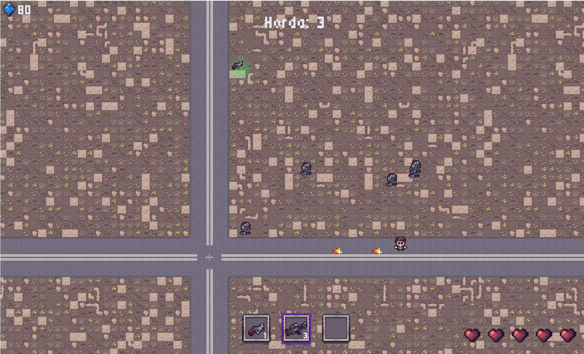
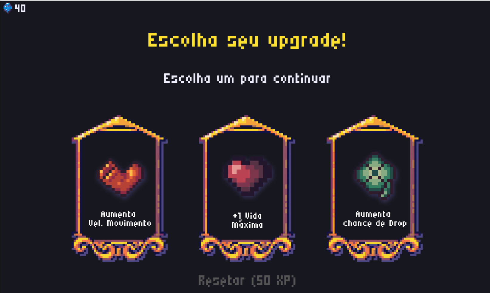
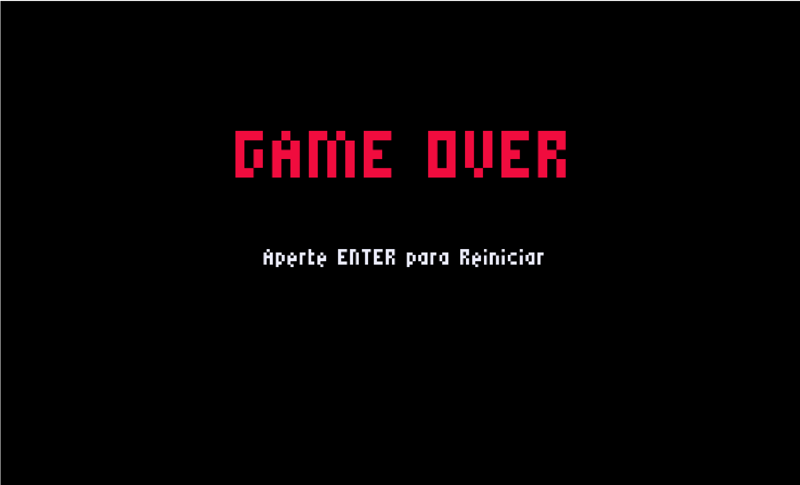

# Eternal Rot

Eternal Rot é um jogo Bullet Heaven em que o jogador é um sobrevivente de um apocalypse zumbi e precisa sobreviver as infinitas e seu objetivo é sobreviver o máximo possível. Os zumbis tem a chance de dropar armas que a cada nível aumentar o alcance, dano e a velocidade de disparo e ao fim de cada horda é possível escolher um upgrade para fortalecer seu personagem.

## Ferramenta Utilizada

[MelonJS](https://melonjs.org/)

## Assets Usados

 [Pixel Heart and Mana UI by HochuPitsu](https://hochupitsu.itch.io/heart-and-mana)

 [Post Apocalypse Pixel Art Asset Pack by TheLazyStone](https://thelazystone.itch.io/post-apocalypse-pixel-art-asset-pack)

 [Raven Fantasy Icons by ClockWork Raven](https://clockworkraven.itch.io/raven-fantasy-icons) & [Tiny RPG - Mana Soul GUI by tiopalada](https://tiopalada.itch.io/tiny-rpg-mana-soul-gui)


## Como rodar

Faça o clone do projeto e abra a pasta dele no terminal.

Em seguida, navegue até a pasta do jogo com 

```sh
cd bullet-heaven
```

E instale as dependências com 

```sh
npm install
```

Após isso, rode o jogo com o comando

```sh
npm run dev
```

## Galeria





